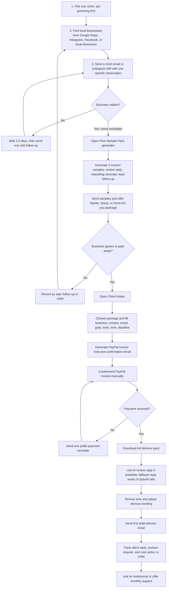

# Local Retention Kit Usage Flow

This is the operating flow for using the project to find a small local-business customer, collect payment, and deliver the first retention kit.

## 中文执行流程

1. 先只做一个细分行业，建议继续从宠物美容开始，直到拿到第一单。
2. 找商家时不要群发模板，至少写一个具体观察点，比如评论回复慢、Instagram 有预约入口、服务有复购周期。
3. 商家回复后，不要马上收钱，先用 Free Sample Pack 生成 3 条免费样例。
4. 样例发出后再提出 $99 Starter、$199 Setup 或 $299 Done-for-you。
5. 只有客户明确同意套餐后，才创建 PayPal invoice。
6. 收款后用 Client Intake 下载交付包，检查语气，再发第一版。
7. 交付后把客户状态更新到 CRM，并在 7 天后跟进反馈或推荐语。

## Operator Checklist

1. Use the live website during outreach so the prospect sees a working demo.
2. For every interested prospect, create a free sample pack before asking for payment.
3. Only create/send a PayPal invoice after the prospect clearly agrees to a package.
4. After payment, use the Client Intake section to download the full delivery pack.
5. Deliver the first version quickly, then ask for a simple testimonial after they approve it.
6. If the AI endpoint returns fallback output, keep using it for delivery and fix the OpenAI account separately.

## Resume Summary

Built a React/Vite productized-service MVP that supports prospect outreach, sample generation, client intake, payment preparation, CRM tracking, CSV order import, and downloadable delivery packs for local service businesses.
