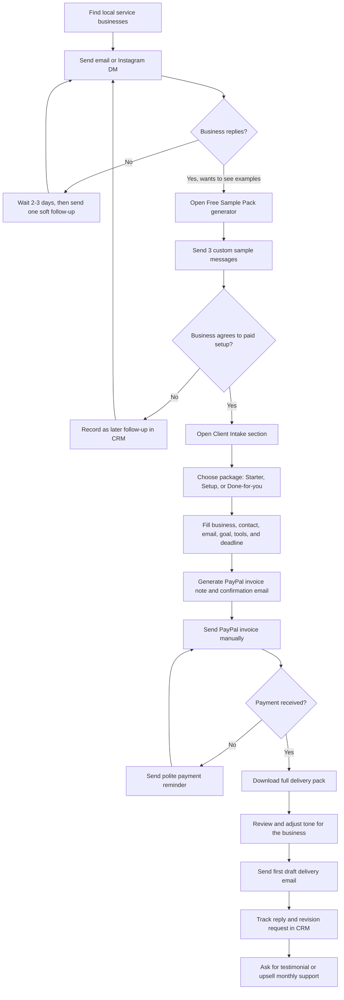

# Local Retention Kit Usage Flow

This is the operating flow for using the project to find a small local-business customer, collect payment, and deliver the first retention kit.

## Operator Checklist

1. Start with one niche, preferably pet grooming until the first paid proof is done.
2. Use the live website during outreach so the prospect sees a working demo.
3. For every interested prospect, create a free sample pack before asking for payment.
4. Only create/send a PayPal invoice after the prospect clearly agrees to a package.
5. After payment, use the Client Intake section to download the full delivery pack.
6. Deliver the first version quickly, then ask for a simple testimonial after they approve it.

## Resume Summary

Built a React/Vite productized-service MVP that supports prospect outreach, sample generation, client intake, payment preparation, CRM tracking, CSV order import, and downloadable delivery packs for local service businesses.
